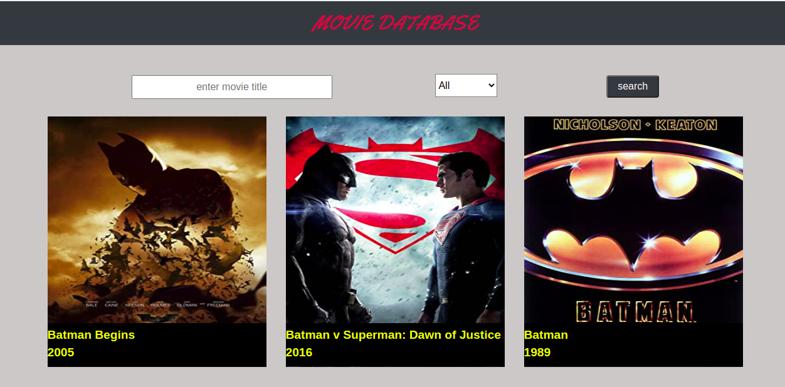

# Catalogue of Statistics of movies
This app is a browsable list of movies that can be filtered and the details of each movie can be obtained.
This project is made up of 2 pages :
- One which displays data fetched from The Open Movie Database(OMDb API) with default movie title`BATMAN` other movies can be searched by entering the movie title in the search field and using the search button to search the movies.
- Another which displays the details of the movie still fetched from The Open Movie Database(OMDb API)
but this time the movieId is passed as a parameter.
# Screenshot

 
## Built With
- Javascript
- HTML
- CSS
- React framework
- Redux
- Webpack
- Jest
- React Testing Library
- Bootstrap
- Redux thunk

## Getting started
   To get a local copy up and running follow these simple example steps and type the necessary highlighted commands on your terminal.
   1. `git clone git@github.com:che30/Statistic-catalogue.git`
   2. `cd Statistic-catalogue`
   3. `git checkout feature`
   4. `npm install or yarn install`
   5. ` npm start`
# TESTS
In order to run tests type the command `npm run test`

## Click the link below to see the live demo
- [Click this link to see live demo](https://chemoviecatalogue.herokuapp.com/)

## Author
**Che Blanchard**
- GitHub: [@che30](https://github.com/che30)
- LinkedIn: [Che Blanchard](https://www.linkedin.com/in/che-nsoh-9455271b0/)
- Twitter: [@che55085128](https://twitter.com/che55085128)
## Acknowledgements
- Microverse
- Behance
- The Open Movie Database(OMDb API)
##  Contributing

Contributions, issues, and feature requests are welcome!

## Show your support

Give a ⭐️ if you like this project!